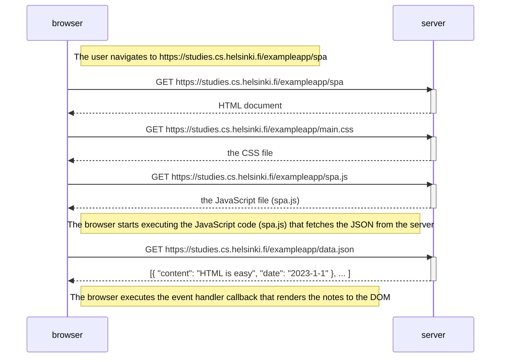

# Exercise 0.5: Single page app diagram

Sequence diagram showing the chain of events when a user navigates to the single-page app version of the notes app (`https://studies.cs.helsinki.fi/exampleapp/spa`).

