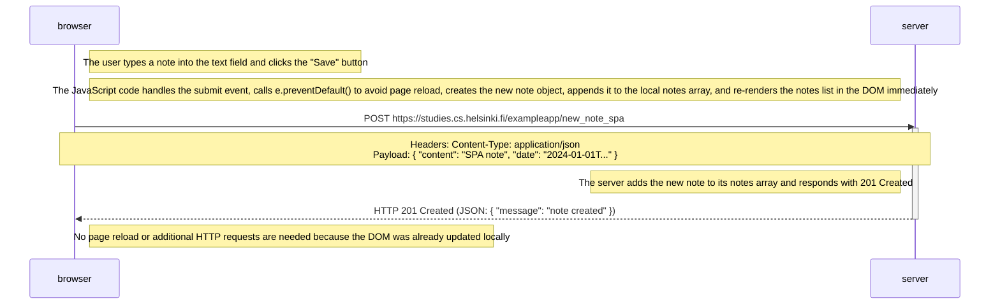

# Exercise 0.6: New note in Single page app diagram

Sequence diagram showing the chain of events when a user creates a new note using the single-page version of the notes app (`https://studies.cs.helsinki.fi/exampleapp/spa`).

