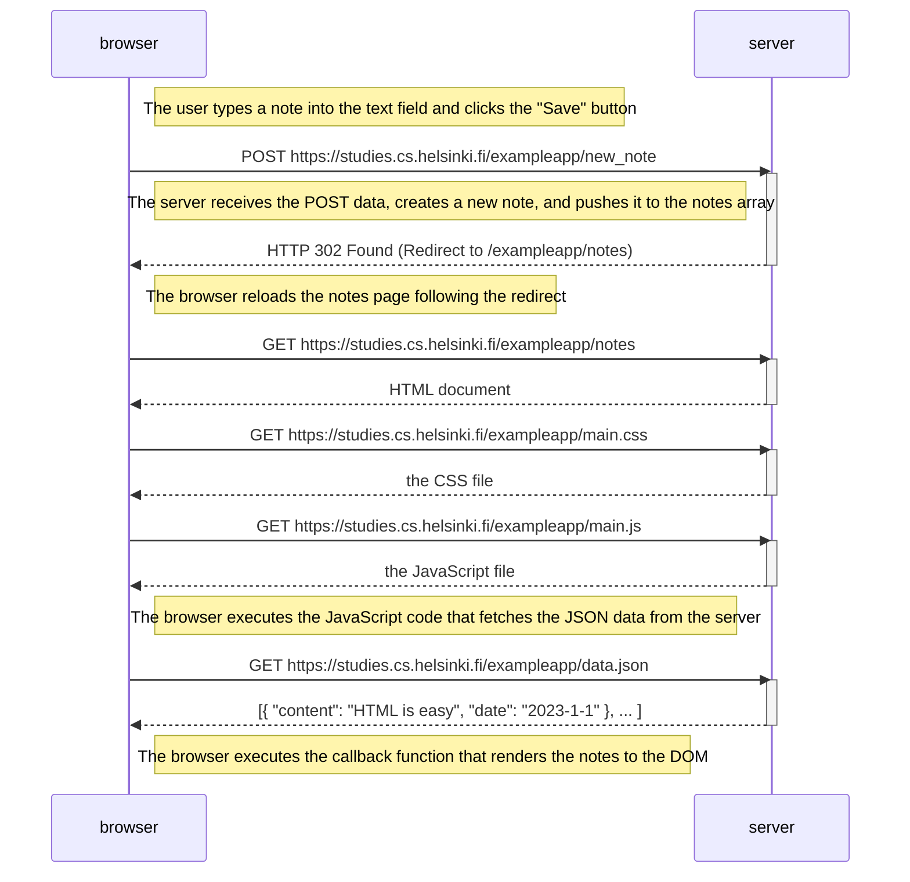
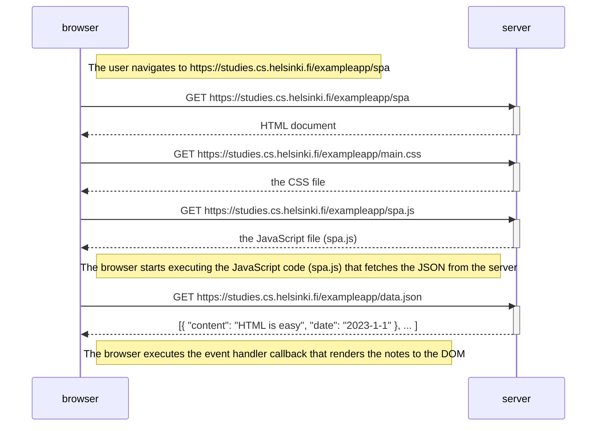
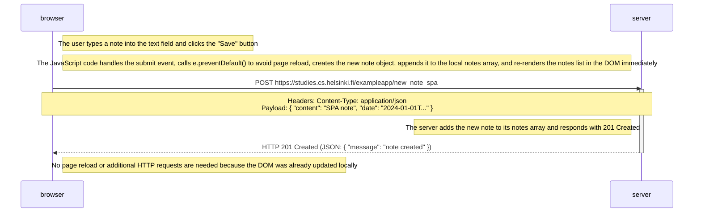

# Part 0: Fundamentals of Web Apps

This directory contains the solutions for exercises 0.4 to 0.6 from [Full Stack Open - Part 0](https://fullstackopen.com/en/part0/fundamentals_of_web_apps#exercises-0-1-0-6).

- [0.4: New note diagram](0.4.md)
- [0.5: Single page app diagram](0.5.md)
- [0.6: New note in Single page app diagram](0.6.md)

---

## 0.4: New note diagram

---

## 0.5: Single page app diagram

---

## 0.6: New note in Single page app diagram

